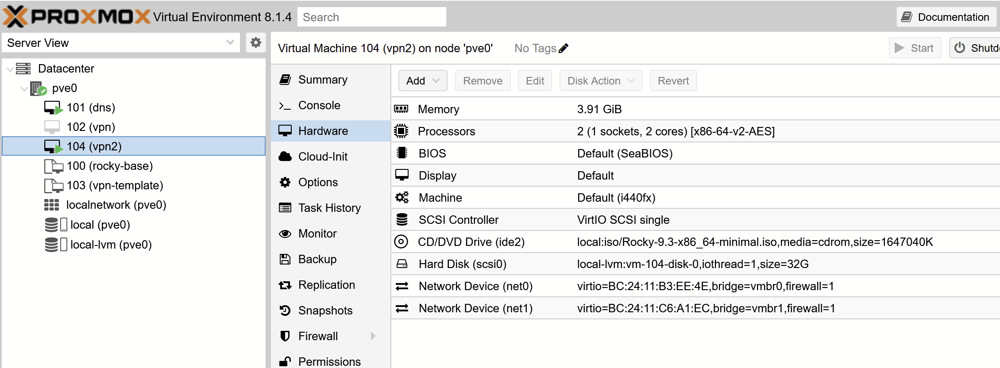
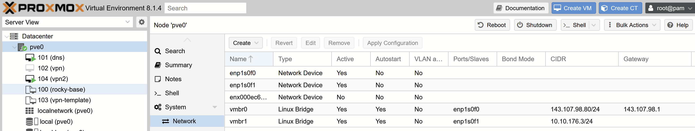

# Ansible

Ansible is an automation tool developed by RedHat which uses python to run tasks on hosts through ssh connections.

General playbook command:

```
ansible-playbook -K playbook.yaml
```

Playbook with vault:

```
ansible-playbook -K -J -e @vault/secrets.enc playbook.yaml
```

List availiable tags for playbook:

```
ansible-playbook playbook.yaml --list-tags
```


## Roles

Roles can be used to group tasks and make them usable in different scenarios

### base

Base role exemplifying how a role can be setup.

### iptables

The iptables role configures rules set in the `roles/iptables/templates/iptables-proxmox.sh` file. These rules were developed with use in a proxmox machine in mind, to allow it to have VMs with private IPs. In other words, this role configures a PVE node to act as a NAT gateway for it's VMs.

Sources:

- https://youtube.com/playlist?list=PLvadQtO-ihXt5k8XME2iv0cKpKhcYqe7i&feature=shared
- https://www.youtube.com/watch?v=ITYMeRE455g

Nomenclature:

- PVE node: proxmox host server
- VM: a virtual machine created inside the PVE node
- Enterprise Lan: the lan where all the enterprise equipment is, including the PVE node (for example, 10.10.10.0/24)
- NAT lan: the NAT lan inside the PVE node to be used only by it's VMs (in this example, 192.168.1.0/24)

For this role configuration to work, it is necessary to setup the PVE node and the manually as such:

#### PVE Node

- Leave the default configuration as is, which means a Linux Bridge interface (vmbr0) with designated port enp1s0f0 (or whatever is the physical interface name on the machine), IPv4 in the Enterprise lan (10.10.10.11) and appropriate gateway (10.10.10.1)
- Add another Linux Bridge interface to the PVE node with IPv4: 192.168.1.1/24, called vmbr1. This will be the gateway for the VMs in the NAT lan
- Set the ssh port to another value other than 22 (in this case 3232)
- Run the ansible role on the PVE node. This will setup packet and port forwarding, masquerading, etc

#### VMs

- Set the IPv4 to some value in the NAT lan, such as 192.168.1.10/24
- Set the gateway to the PVE node's IP in the NAT lan (192.168.1.1)
- Set the DNS to whatever is appropriate (in this case, 10.10.10.4)
- In the Hardware tab, set the Network Device to vmbr1

### DNS

Prerequisites:

- Configure a single manual IPv4 address on the server.

To update only the hosts file, use the `--tags hosts` flag

### Ansys

Prerequisites:

- Mounting the ansys NFS on the machine on /share/ansys to have access to the ISO files.

### VPN

Prerequisites:

- Host machine should have a proper DNS configuration on `/etc/resolv.conf`
- Host machine should have two network interfaces

  - The first interface should have a public IP
  - The second interface should have the private IP. When using network manager, this interface can have the DNS servers configured in order for VPN users to have access to the internal DNS, as the script uses the `/etc/resolv.conf` DNSs

- Recommended: set SSH listen address to the private IP address to forbid SSH connections from the internet and stop brute force password attacks.

`/etc/ssh/sshd_config`:

```
...
ListenAddress 10.10.176.6
...
```

#### Proxmox configuration

The VM should have 2 network devices (VM > hardware > add)


The interfaces on the main node should be configured according to the networks on each interface.


### Zabbix

Sources:

- Server: https://www.zabbix.com/download?zabbix=7.0&os_distribution=rocky_linux&os_version=9&components=server_frontend_agent&db=mysql&ws=apache and https://www.zabbix.com/documentation/3.0/en/manual/installation/install_from_packages/server_installation_with_mysql
- Clients: https://www.zabbix.com/documentation/3.0/en/manual/installation/install_from_packages/agent_installation

The user guide for zabbix can be found at https://www.zabbix.com/documentation/7.0/en/manual/quickstart/login

#### Web browser installation steps

After running the zabbix role with ZABBIX_CONFIGURE_SERVER set to true, it's still necessary to do some configuration on the browser.

- Configure DB connection
  - Database host: localhost
  - Database port: 3306
  - Database name: zabbix
  - User: zabbix
  - Password: zabbix

> Note: you may encounter an error saying "permission denied". This can be caused by SELinux. A quick and unsafe fix is to run `setenforce 0` to disable SELinux. Note that this will only last until the next reboot.

- Settings

  - Zabbix server name: gres
  - Default time zone: UTC-03:00
  - Default theme: Blue

- Pre-installation summary
  - Database type: MySQL
  - Database server: localhost
  - Database port: 3306
  - Database name: zabbix
  - Database user: zabbix
  - Database TLS encryption: false
  - Zabbix server name: zabbix

#### Post installation steps

- Log in with admin account (username: Admin, password: zabbix)

- Change Admin password (do not use an important password if the connection is http)

Go to User Settings > Profile > Change password.

- Follow the [documentation](https://www.zabbix.com/documentation/current/en/manual/quickstart/host) to add hosts (Quickstart > New host)

Data collection > Hosts > Create host

Add interfaces > Agent > Add host info

- It is also required to add items to get metrics for the hosts (item = metric). There is a template that gathers all the important items for the workstations called `WorkstationMonitoring`, so it shouldn't be necessary to add items individually, as long as the workstation host is configured with this template. However, here's a list of ome useful item keys:

  - CPU usage: system.cpu.util
  - Memory availiable: vm.memory.size[available]
  - Memory usage: vm.memory.size[active]
  - Available memory in %: vm.memory.size[pavailable]

More information on items can be found at https://www.zabbix.com/documentation/current/en/manual/config/items/itemtypes/zabbix_agent

- It is also important to make sure the listen port is open on the client's firewall (default: 10050)

- To view data:

Monitoring > Latest data > Select the hosts in the filter and click Apply > Select the hosts' checkboxes > Display graph
